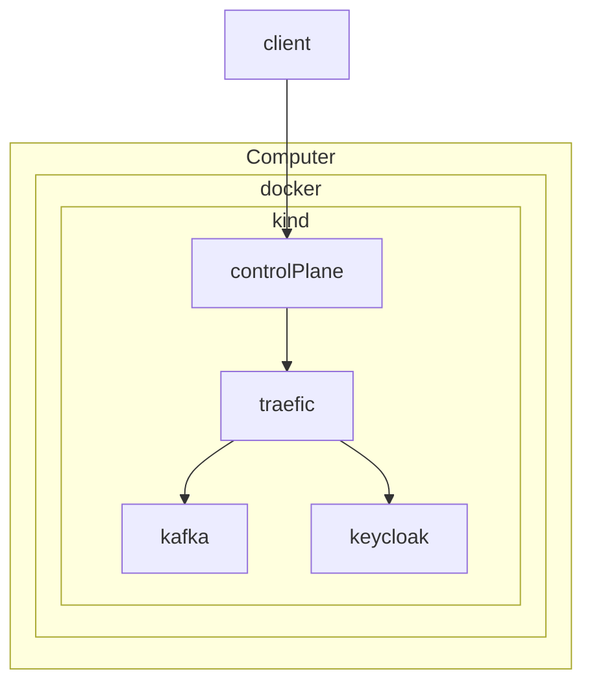

# Kubernetes toy cluster for development

This repository contains an example for a local development environment on kubernetes. The motivation
of this project is given in the 2024 blog post by Daniel Roth on the DenktMit tech blog:
[Local Development for Kubernetes done right](https://denktmit.de/blog/2024-02-28-local-development-for-kubernetes-done-right/).

## Contents

This project is supposed to be rolled out on your desktop computer or a machine with a proper
browser installed. The reason for this is the way how services are identified by their web domain
name.

This project contains:
- [Strimzi Kafka Operator](https://github.com/strimzi/strimzi-kafka-operator/tree/0.40.0/examples)
  - Preconfigured Kafka Cluster
- [Strimzi Registry Operator](https://github.com/lsst-sqre/strimzi-registry-operator)
  - Preconfigured Schema Registry
- [keycloak](https://www.keycloak.org/)
- [traefik](https://doc.traefik.io/traefik/)
- [cert-manager](https://cert-manager.io/)

Traefik and cert-manager is configured for local DNS resolution and tls with valid certificates

## Prerequisites

1. Docker Installed https://www.docker.com/
2. Kind Installed https://kind.sigs.k8s.io/
3. Helm Installed https://helm.sh/docs/intro/install/
4. mkcert installed https://github.com/FiloSottile/mkcert?tab=readme-ov-file#installation




### Steps

Follow these steps to set up a local test environment

#### Create a local trusted root certificate authority

mkcert will create a rootCa that is trusted on your local maschine. Due to the installation of local kind cluster, a
secret containing the rootCa key is created so cert-manager will use it as a cluster issuer.

```shell
mkcert -install
```

#### Create Kind Cluster

```bash
kind create cluster --config=./kind/kind-cluster.yaml
```

After the installation is done, verify that correct context is used:

```shell
kubectl config current-context
```

It should print `kind-lgc`. If not see Set Context

### Prepare all needed helm charts

```shell
helm dep up charts/strimzi-kafka-operator
helm dep up charts/traefik 
helm dep up charts/cert-manager
helm dep up charts/strimzi-registry-operator
```

### Installing the operators

```shell
export PROJECT_DOMAIN="local.lgc"
helm upgrade --install --create-namespace --namespace cert-manager cert-manager charts/cert-manager --atomic
helm upgrade --install --create-namespace --namespace traefik traefik charts/traefik --atomic
helm upgrade --install --create-namespace --namespace strimzi-kafka-operator strimzi-kafka-operator charts/strimzi-kafka-operator --atomic
## NOTE: If the above command fails with a timeout error, try an upstream version instead:
# helm upgrade --install -n strimzi-kafka-operator  strimzi-registry-operator charts/strimzi-registry-operator
kubectl create secret tls root-ca-secret \
  --cert="$(mkcert -CAROOT)/rootCA.pem" \
  --key="$(mkcert -CAROOT)/rootCA-key.pem" \
  --namespace=cert-manager
helm upgrade --install -n strimzi-kafka-operator  strimzi-registry-operator charts/strimzi-registry-operator
helm upgrade --create-namespace --install -n glue glue ./charts/dev-glue --atomic  --set "global.projectDomain=${PROJECT_DOMAIN}"
helm upgrade --install --create-namespace --atomic  --namespace keycloak keycloak ./charts/keycloak  --set "global.projectDomain=${PROJECT_DOMAIN}"
```

### Setup / Recreate using Earthly

You can also use the [Earthly](https://github.com/earthly/earthly) scripts to install or recreate the cluster within minutes.

NOTE: This will not install the [prerequisities](#Prerequisites). Furthermore, note that open-source earthly reached end-of-life.

#### Create
```bash
earthly +kind-create-local
```

#### Recreate
```bash
earthly +kind-recreate-local
```

### Testing service reachability

Point your browser for instance to https://keycloak.local.lgc. If you don't have a browser at hand,
you can try, for instance:

```shell
curl -H "Host: keycloak.local.lgc" http://127.0.0.1
```

### get kafka secret

```shell
kubectl get secrets -n glue kafka-super-user -o jsonpath='{.data.user\.password}' | base64 -d > userpass.txt
cat "$(mkcert -CAROOT)/rootCA.pem"  > ca.crt
kubectl get secrets -n glue kafka-super-user -o jsonpath='{.data.ca\.crt}' | base64 -d >> ca.crt
kubectl get secrets -n glue kafka-super-user -o jsonpath='{.data.user\.p12}' | base64 -d > user.p12 
```

### Kafka Settings for Big Datatools in Intellij

Please replace the `[PATH_TO_CERT]` and `[content of userpass.txt]` with the config below

```properties
security.protocol=SSL
bootstrap.servers=bootstrap.local.lgc:9094
ssl.keystore.type=PKCS12
ssl.keystore.location=[PATH_TO_CERT]/user.p12
ssl.keystore.password=[content of userpass.txt]
ssl.truststore.type=PEM
ssl.truststore.location=[PATH_TO_CERT]/ca.crt
```

### Accessing your Ingresses

To access your ingresses you should add them to your /etc/hosts

```bash
127.0.0.1       keycloak.local.lgc
127.0.0.1       b0.local.lgc
127.0.0.1       bootstrap.local.lgc
127.0.0.1       sr.local.lgc
```

### Set Context (also happens after cluster creation)

```bash
kind export kubeconfig --name lgc
```

#### Clean up

```bash
kind delete cluster --name lgc
```

## Keycloak Sandbox realm

keycloak is running in dev mode

### Users

* admin:admin
* reader:reader
* writer:writer

### Groups:

* admins
* readers
* writers

### Roles:

* admin-action
* reader-action
* writer-action

### Public client sandbox-ui

Usage within

```typescript
import {AuthProviderProps} from "react-oidc-context";

const oidcConfig: AuthProviderProps = {
    authority: "https://keycloak.local.lgc/realms/sandbox",
    client_id: "sandbox-ui",
    redirect_uri: document.baseURI,
};
```

### Accessing the Schema Registry

The schema registry is available at `https://sr.local.lgc`
