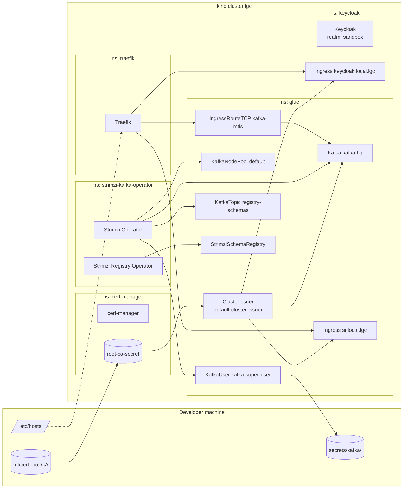

# Architecture

The platform is a kind cluster with five upstream operators or controllers and one first-party glue chart that wires
them into a working Kafka stack. There is no GitOps and no remote state. Everything is recreated from local files.

## Component view

The arrows from `mkcert` and `/etc/hosts` are not Kubernetes references; they show host-side artifacts the cluster
depends on.

## Install order

The order matters because later resources reference secrets and CRDs created earlier. The setup script executes the
steps below.

| # | Step                                          | Why this order                                                                                          |
|---|-----------------------------------------------|---------------------------------------------------------------------------------------------------------|
| 1 | Create the kind cluster                       | Everything else runs inside it                                                                          |
| 2 | `helm dep up` for the wrapper charts          | Pulls upstream chart archives into `charts/*/charts/`                                                   |
| 3 | Install cert-manager                          | Defines `Certificate` and `ClusterIssuer` CRDs that later charts use                                    |
| 4 | Install Traefik                               | Provides `IngressRoute*` CRDs and the `kafka-mtls` TCP entrypoint                                       |
| 5 | Install the Strimzi operator                  | Defines `Kafka`, `KafkaUser`, `KafkaTopic`, `KafkaNodePool` CRDs                                        |
| 6 | Create `root-ca-secret` from `mkcert -CAROOT` | Consumed by the `default-cluster-issuer` in step 8                                                      |
| 7 | Install the Strimzi Registry Operator         | Watches `StrimziSchemaRegistry` resources created in step 8                                             |
| 8 | Install `dev-glue`                            | Creates the issuer, the Kafka cluster, the user, the topic, the schema registry, and the Traefik routes |
| 9 | Install Keycloak                              | Independent of `dev-glue`; only needs cert-manager for its Ingress                                      |

The Strimzi Registry Operator is installed into the `strimzi-kafka-operator` namespace on purpose. It watches the same
Strimzi resources from there and creates a Schema Registry deployment in the `glue` namespace based on the configured
`clusterNamespace`.

## Namespaces

| Namespace                | Owns                                                                                               |
|--------------------------|----------------------------------------------------------------------------------------------------|
| `cert-manager`           | cert-manager controllers, `root-ca-secret`, webhook                                                |
| `traefik`                | Traefik deployment and entrypoints                                                                 |
| `strimzi-kafka-operator` | Strimzi Cluster Operator, Strimzi Registry Operator                                                |
| `glue`                   | The Kafka cluster, the schema topic and registry, the `default-cluster-issuer`, the Traefik routes |
| `keycloak`               | Keycloak deployment and its Ingress                                                                |

## What survives a recreate

When the cluster is deleted, all of its volumes go with it. The PV for the Kafka node pool is annotated with
`deleteClaim: true` and the broker `Kafka` jbod volume with `deleteClaim: false`, but neither survives
`kind delete cluster` because the underlying Docker volume disappears with the kind nodes. Treat the cluster as
ephemeral.

The host-side artifacts in `secrets/kafka/` and the generated `application.yaml` survive. They are tied to credentials
that are reissued on the next bring-up, so regenerate them with `./scripts/kind_setup.sh get-secrets` after every
recreate.

## Next

- [Components](components.md)
- [Network and TLS](network-and-tls.md)
