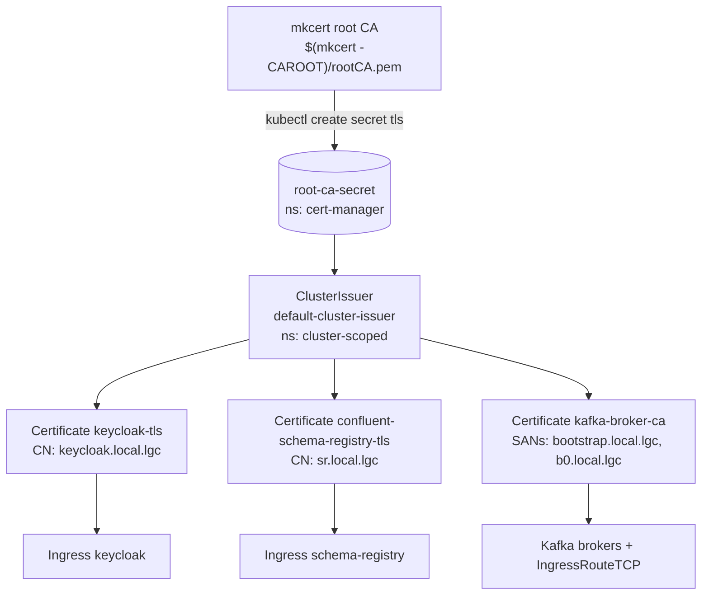
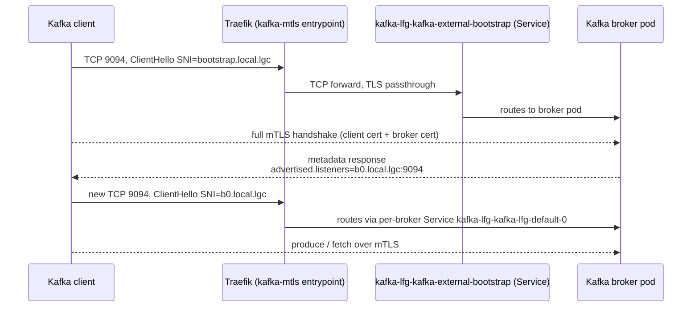

# Network and TLS

External traffic enters the cluster through Traefik on the kind control-plane node. HTTP and HTTPS traffic uses standard
`Ingress` resources with cert-manager-issued TLS. Kafka uses a Traefik `IngressRouteTCP` with TLS passthrough so that
mutual TLS terminates inside the broker.

## Host port mapping

The kind config (`kind/kind-cluster.yaml`) maps three ports from the control-plane container to the host. The Traefik
chart uses the same port numbers as `hostPort` on its deployment, so no Service object is involved.

| Host port | Container port | Traefik entrypoint | Used by                                              |
|-----------|----------------|--------------------|------------------------------------------------------|
| 80        | 80             | `web`              | HTTP redirect / unencrypted Ingress                  |
| 443       | 443            | `websecure`        | HTTPS for `keycloak.local.lgc`, `sr.local.lgc`       |
| 9094      | 9094           | `kafka-mtls`       | Kafka mTLS for `bootstrap.local.lgc`, `b0.local.lgc` |

Traefik runs with `nodeSelector: ingress-ready: "true"` and tolerations for the control-plane taint, which keeps it on
the node that owns the host ports.

## Certificate chain

cert-manager issues every TLS certificate in the cluster from a single `ClusterIssuer` named `default-cluster-issuer`.
That issuer is backed by the `root-ca-secret` in the `cert-manager` namespace, which is just a copy of your local mkcert
root CA. Because mkcert has already added that root to the system trust store, browsers and JVM clients trust the leaf
certificates without further configuration.

Keycloak and Schema Registry use the leaf certificates the normal way: the `Ingress` annotation
`cert-manager.io/cluster-issuer: default-cluster-issuer` causes cert-manager to provision and renew the certificate, and
Traefik terminates TLS using the resulting Secret.

The `kafka-broker-ca` Secret is referenced twice: once by the `Kafka` resource as `brokerCertChainAndKey` so the broker
presents it during the TLS handshake, and once by the `IngressRouteTCP` so that Traefik recognises the SNI hostnames
before forwarding. Traefik does not terminate TLS for Kafka.

## Kafka mTLS over Traefik

The Kafka external listener is `type: cluster-ip`, not NodePort or LoadBalancer. The cluster-ip Service exists only
inside the cluster; external clients reach it through Traefik on host port 9094.

Traefik uses the SNI server name from the client's `ClientHello` to choose between the bootstrap Service and the
per-broker Service. That works because Kafka clients always include the advertised hostname in SNI (
`bootstrap.local.lgc` for the initial connection, `b0.local.lgc` once the broker metadata is exchanged). With more
brokers, you would add one route per broker and one `bN.local.lgc` SAN to the broker certificate.

Two consequences worth keeping in mind:

- The broker certificate must contain every advertised hostname as a SAN. Adding a broker means updating
  `charts/dev-glue/templates/kafka/cert.yaml` and the `IngressRouteTCP`, otherwise the second-hop connection fails the
  hostname check.
- The client must trust the chain in `secrets/kafka/ca.crt` (mkcert root + the Strimzi cluster CA). Trusting only the
  system store is not enough because Kafka's internal CA is separate from mkcert.

## Where things break

| Symptom                                                     | Likely cause                                                                        |
|-------------------------------------------------------------|-------------------------------------------------------------------------------------|
| Browser shows TLS warning                                   | `mkcert -install` was not run on this host                                          |
| Browser shows TLS warning after machine reset               | mkcert root was reset; rerun `mkcert -install` and recreate the `root-ca-secret`    |
| Kafka client gets `unable to find valid certification path` | Trust store missing `ca.crt`; regenerate with `./scripts/kind_setup.sh get-secrets` |
| Kafka connect succeeds then fails on first produce          | `b0.local.lgc` not in `/etc/hosts`                                                  |
| `kubectl get certificate -A` shows `Ready=False`            | `root-ca-secret` is missing or `default-cluster-issuer` is not yet reconciled       |

## Next

- [Kafka and Schema Registry](../developer-guide/kafka-and-schema-registry.md)
- [Troubleshooting](../operations/troubleshooting.md)
